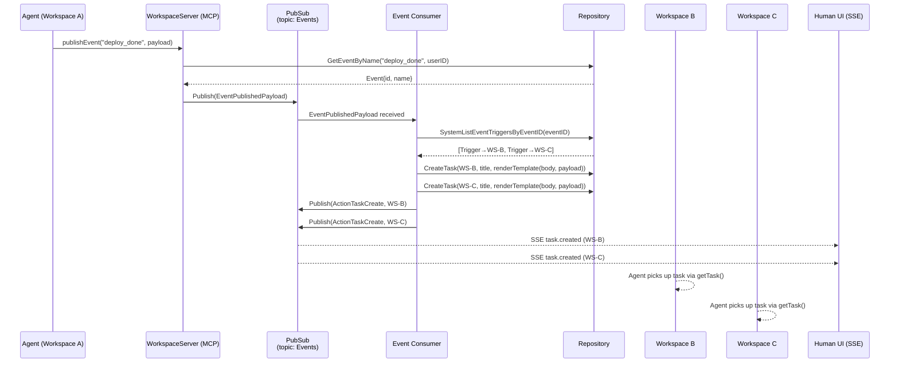
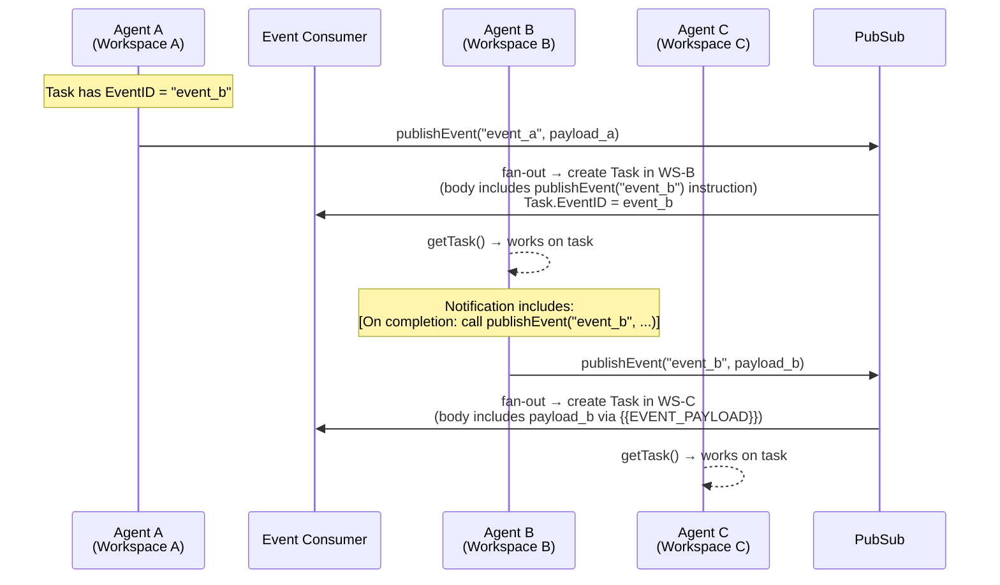

# AgentRQ Architecture

## Overview

AgentRQ is a task orchestration platform that connects human operators and AI agents through a structured, real-time communication layer. Each **workspace** is an isolated execution context with its own dedicated **MCP (Model Context Protocol) server**, and agents connect to workspaces via those servers to receive tasks, send replies, and report status. A supervisor agent — by connecting to the **Core MCP server** (`coremcp`) with a single OAuth2-authenticated session — gains cross-workspace visibility and can orchestrate multi-agent workflows by assigning tasks to specialist agents across any number of workspaces.

---

## Core Concepts

### Workspace

A workspace represents a scoped mission environment. It holds:
- A **name** and **description** (the mission brief)
- A **self-learning loop note** (guidelines injected into agent-assigned tasks)
- An **encrypted session token** (16-char secret, AES-GCM encrypted at rest) that authenticates agent connections
- A list of **auto-allowed tools** (agent tool calls pre-approved without human intervention)
- An optional **`AllowAllCommands`** flag (bypasses all permission gating for a workspace)

Workspaces can be archived (frozen, read-only). They can be active or archived; archived workspaces reject new task creation.

### Task

A task is the atomic unit of work. Key fields:

| Field | Description |
|-------|-------------|
| `WorkspaceID` | The workspace this task belongs to |
| `CreatedBy` | `human` or `agent` |
| `Assignee` | `human` or `agent` |
| `Status` | `notstarted`, `ongoing`, `completed`, `rejected`, `blocked`, `cron` |
| `Title` / `Body` | Task description |
| `CronSchedule` | 5-field cron string (for scheduled task templates) |
| `ParentID` | Set when a task is spawned from a cron template |
| `TriggerID` | ID of the event that caused this task (set by the event consumer) |
| `EventID` | ID of the event this task should publish on completion |
| `SortOrder` | Controls queue priority for `getTask` (next-task dequeue) |
| `AllowAllCommands` | Per-task override for permission gating |

### Message

Each task has a threaded conversation history. Messages record every exchange between the human operator, the agent, and the system. Messages carry:
- `Sender`: `human`, `agent`, or `slack`
- `Text` and optional `Attachments`
- `Metadata`: JSON blob used for permission request lifecycle tracking (`{type, request_id, tool_name, status}`)

---

## MCP Server Layer

AgentRQ exposes **two distinct MCP server tiers**: the Core MCP server for supervisors and human-level orchestration, and per-workspace MCP servers for specialist worker agents.

### Supervisor MCP Server (`coremcp`)

The Core MCP server is a **single, stateless server** instance accessible at `/mcp` (path-based) or `mcp.{domain}` (host-based). It is the entry point for supervisor agents and any MCP client that needs cross-workspace visibility.

**Authentication** uses OAuth2 with a short-lived access token bearing audience `"coremcp"`. The token encodes the authenticated user's ID (not a workspace token), so every tool call runs in the context of that user's full workspace access.

**User-scope enforcement**: Every coremcp handler extracts the user ID from the JWT context and passes it to the CRUD controller. The controller validates workspace ownership on every operation via `ensureActiveWorkspace(ctx, workspaceID, userID)`, which issues a DB query requiring both the workspace ID and the user's ID to match. A workspace belonging to another user returns a not-found error — cross-user access is impossible regardless of which tool is called.

The coremcp exposes a broad, cross-workspace tool surface:

| Tool | Description |
|------|-------------|
| `listWorkspaces(includeArchived?)` | List all user-accessible workspaces; each result includes the workspace's `mcpURL` (the per-workspace MCP endpoint URL) |
| `createWorkspace(name, description?, ...)` | Create a new workspace |
| `getWorkspace(id)` | Get a single workspace by ID (with `mcpURL`) |
| `updateWorkspace(id, ...)` | Update workspace metadata |
| `getWorkspaceStats(id, range)` | Task statistics for a workspace |
| `listTasks(workspaceId, filter?, status?, limit?)` | List tasks in a specific workspace |
| `listAllTasks(filter?, status?, limit?)` | List tasks across all user workspaces |
| `createTask(workspaceId, title, body?, assignee?, cronSchedule?)` | Create a task in **any** workspace by ID |
| `getTask(workspaceId, taskId)` | Fetch a single task |
| `replyToTask(workspaceId, taskId, text)` | Post a message to a task thread |
| `respondToTask(workspaceId, taskId, action)` | Submit allow/deny for a permission request |
| `updateTaskStatus(workspaceId, taskId, status)` | Update task status |
| `updateTaskOrder(workspaceId, taskId, sortOrder)` | Reorder tasks in a workspace queue |
| `updateTaskAssignee(workspaceId, taskId, assignee)` | Reassign a task between human and agent |
| `updateTaskAllowAll(workspaceId, taskId, allowAll)` | Toggle unrestricted permission mode for a task |
| `updateScheduledTask(workspaceId, taskId, ...)` | Modify a cron task template |
| `getAttachment(workspaceId, attachmentId)` | Retrieve a file attachment as base64 |

### Per-Workspace / Agent Worker MCP Servers

Each workspace gets its own MCP server instance (`WorkspaceServer`), created lazily on the first agent connection and managed by a central `Manager`. The manager uses a read-write lock and a `map[workspaceID → WorkspaceServer]` for safe concurrent access.

Worker agents connect via:
- **Path-based**: `POST /mcp/{workspaceID}` (Streamable HTTP transport)
- **Subdomain-based**: `{workspaceID}.mcp.{domain}`

Authentication uses the workspace's encrypted token (a 16-char secret, AES-GCM encrypted at rest, provided as a bearer token). Once authenticated, the agent communicates with that workspace exclusively — it has no visibility into other workspaces.

Every agent connected to a per-workspace MCP server has access to exactly these tools:

| Tool | Description |
|------|-------------|
| `getWorkspace()` | Returns workspace name, description, and task stats |
| `getTask(taskId?, includeConversation?, cursor?, limit?)` | With no `taskId`, dequeues the next `notstarted` agent-assigned task (sorted by `SortOrder`); with a `taskId`, returns that task. `includeConversation` appends paginated message history |
| `createTask(title, body, assignee?, attachments?, cronSchedule?, eventId?)` | Creates a new task (or cron template) in this workspace; `eventId` links a task to the event it should publish on completion |
| `updateTaskStatus(taskId, status)` | Transitions task state; auto-appends a status message |
| `reply(chatId, text, attachments?)` | Sends a message in a task's conversation thread |
| `downloadAttachment(attachmentId, taskId)` | Retrieves a file attachment as base64 |
| `publishEvent(name, payload, faq?)` | Fires a named event with a payload and optional FAQ; fans out to all matching `EventTrigger` rows, creating tasks in subscribed workspaces |

All state mutations go through the MCP tool layer — there is no direct database access for agents.

---

## Supervisor → Worker Architecture

### How a Supervisor Agent Coordinates Workspaces

A supervisor agent connects to the **Supervisor MCP server** (`coremcp`) via a single OAuth2-authenticated session. This one connection gives the supervisor full cross-workspace control — no need to hold per-workspace tokens or manage multiple MCP sessions simultaneously.

The coordination flow looks like this:

```
Supervisor Agent
└── MCP Session → coremcp (/mcp)                [OAuth2, user-scoped]
                  ├── listWorkspaces()           → discovers all workspaces + their mcpURL
                  ├── createTask(workspaceId=B)  → assigns task to coding agent
                  ├── createTask(workspaceId=C)  → assigns task to docs agent
                  ├── createTask(workspaceId=D)  → assigns task to publishing agent
                  └── listTasks(workspaceId)     → monitors progress across any workspace

Worker Agents (one per workspace, each with its own MCP session)
├── MCP Session → /mcp/{workspaceB}             [workspace token, isolated]
├── MCP Session → /mcp/{workspaceC}             [workspace token, isolated]
└── MCP Session → /mcp/{workspaceD}             [workspace token, isolated]
```

The supervisor never touches per-workspace MCP endpoints. It sees everything through the coremcp and uses `createTask(workspaceId, ...)` to delegate subtasks to specialist agents. Each worker agent is entirely isolated within its own workspace MCP server and is unaware of the broader pipeline.

### Step-by-Step: Supervisor Spawning a Cross-Workspace Workflow

1. **Human → Supervisor**: Human creates a task in the supervisor workspace (via the UI or REST API) with a high-level goal (e.g., "Write, document, and publish the new authentication module").

2. **Supervisor picks up task**: The supervisor, connected to `coremcp`, receives the task via the AgentRQ workspace MCP server it also runs in. It calls `updateTaskStatus(workspaceId, taskId, "ongoing")`.

3. **Supervisor discovers workspaces**: Supervisor calls `listWorkspaces()` on coremcp. The response includes each workspace's ID, name, description, and `mcpURL` — the URL the specialist worker agent in that workspace is connected to.

4. **Supervisor creates subtasks**: For each specialist workspace (coding, docs, publishing), the supervisor calls `createTask(workspaceId="...", title="...", body="...", assignee="agent")` on coremcp. Each call creates a task in the target workspace and returns its ID.

5. **Specialist agents work**: Each specialist workspace agent runs its own `getTask` → `ongoing` → `reply` → `completed` cycle independently, entirely within their workspace MCP server.

6. **Supervisor monitors**: Supervisor calls `listTasks(workspaceId, status="completed")` or `getTask(workspaceId, taskId)` on coremcp to track worker progress. When a worker marks its task `completed`, the supervisor reads the result from the task data and uses it as input for the next stage.

7. **Supervisor chains the pipeline**: Once Stage 1 (coding) completes, the supervisor creates the Stage 2 (docs) task in the docs workspace, embedding Stage 1's output in the task body. This continues through each stage of the pipeline.

8. **Supervisor reports back**: When all stages are complete, the supervisor calls `replyToTask(workspaceId, supervisorTaskId, summary)` and `updateTaskStatus(workspaceId, supervisorTaskId, "completed")` via coremcp. The human sees the full result in the UI.

---

## Request / Event Flow

### Task Creation (Human Path)

```
Human (UI)
  → POST /api/v1/workspaces/{id}/tasks
  → CRUD Controller (validates, persists, stores attachments)
  → Repository (GORM → SQLite / PostgreSQL)
  → PubSub event (ActionTaskCreate, ActorHuman)
  → Central Forwarder (PubSub → EventBus)
  → SSE stream → Human UI (task.created event)
  → MCP Manager notifies workspace agent (if task is agent-assigned)
```

### Task Creation (Agent Path via MCP)

```
Agent
  → MCP tool call: createTask(...)
  → WorkspaceServer callback
  → CRUD Controller (same validation + persistence path)
  → PubSub event (ActionTaskCreate, ActorAgent, OriginMCP)
  → Central Forwarder → EventBus SSE → Human UI
  → (if assignee="agent" in another workspace) Supervisor delegates via coremcp createTask(workspaceId, ...)
```

### Agent Task Execution Loop

```
Agent
  → getTask()          ← dequeues first notstarted task
  → updateTaskStatus(ongoing)
  → [work happens]
  → reply(chatId, "...")   ← intermediate progress updates
  → reply(chatId, result)  ← final output
  → updateTaskStatus(completed)
```

At each step, the MCP server persists the message and emits an SSE event so the human operator can follow along in real time.

---

## Permission Gating

Agents operating via Claude Code may request permission for sensitive tool calls (bash commands, file writes, etc.). AgentRQ intercepts these via the MCP protocol's notification channel:

1. **Agent requests permission** → MCP server receives `notifications/claude/channel/permission_request`
2. **Auto-allow check**: Is the tool in `workspace.AutoAllowedTools` or does the task have `AllowAllCommands = true`? If yes → auto-approve, record approval, continue.
3. **Human review**: Otherwise, a `Message` is created with `metadata.type = "permission_request"` and pushed to the human UI via SSE.
4. **Human responds** via `POST /workspaces/{id}/tasks/{taskId}/permission` with behavior: `allow`, `deny`, or `allow_always`.
5. **Verdict delivered** → MCP server sends `notifications/claude/channel/permission` back to the agent session. If `allow_always`, the tool is added to `workspace.AutoAllowedTools` for all future calls.

This gating applies per-session, per-workspace, and can be bypassed at the task or workspace level for trusted automation.

---

## Real-Time Event System

AgentRQ uses two complementary event systems:

### EventBus (SSE)
- In-memory pub/sub keyed by `workspaceID` and `userID`
- Human UI subscribes via `GET /workspaces/{id}/events`
- Events are JSON-encoded SSE frames: `data: {type, payload}\n\n`
- Slow consumers are dropped (non-blocking sends)
- Event types: `task.created`, `task.updated`, `status.updated`, `message.created`, `agent.connected`, `workspace.updated`

### PubSub (Internal)
- Separate async bus for system-level concerns
- Topics: `PubSubTopicCRUD` (entity lifecycle events), `PubSubTopicMCP` (tool call telemetry), `PubSubTopicEvents` (named event signals)
- Consumed by: Slack controller, notification service, push service, central SSE forwarder, telemetry, event consumer

The **Central Forwarder** bridges them: it subscribes to the CRUD PubSub topic and translates entity events into workspace-scoped SSE events on the EventBus.

---

## Scheduled Tasks (Cron)

Tasks with `status = "cron"` are templates managed by the Scheduler service:

- Scheduler polls every 60 seconds
- Parses each template's 5-field cron schedule
- When the current minute matches, spawns a **child task** (copies title, body, attachments, `AllowAllCommands`; sets `ParentID`, `status = "notstarted"`)
- **One-time tasks** (fixed day/month): parent template is deleted after spawning
- **Recurring tasks** (wildcards in day/month): parent persists for future runs
- **Granularity rule**: minute field must be a single integer (0–59); wildcards/ranges/steps are rejected — enforcing a minimum hourly granularity

This allows supervisors to schedule recurring subtask generation without human intervention.

---

## Events (Cross-Workspace Signals)

Events are named signals that let one workspace trigger tasks in other workspaces — enabling decoupled, event-driven multi-agent pipelines without requiring a supervisor agent to coordinate.

### Core Concepts

| Entity | Description |
|--------|-------------|
| `Event` | A named signal definition owned by a user. Has a `name` (unique per user, lowercase letters/digits/underscores) and an optional `payloadGuidelines` hint for agents publishing it |
| `EventTrigger` | A subscription: when a named event fires, create a task in `WorkspaceID` using the stored `Title` and `Body` template. Optional `EmitEventID` chains to a second event on the spawned task's completion |
| `Task.EventID` | Links a task to the event it should publish when completed. The assigned agent receives an explicit `publishEvent` instruction in its task notification |
| `Task.TriggerID` | Records which event caused this task (set by the event consumer at creation time) |

### Publishing Flow

```
Agent calls publishEvent("deploy_done", "v2.3 deployed to prod")
  → WorkspaceServer.handlePublishEvent
  → PublishEventFunc (wired in app.go): looks up event by name + userID
  → pubsubSvc.Publish(PubSubTopicEvents, EventPublishedPayload{...})
  → Event Consumer (controller/event) receives message
  → repo.SystemListEventTriggersByEventID(eventID)
  → For each EventTrigger:
      body = renderTemplate(trigger.Body, payload, faqText)   ← {{EVENT_PAYLOAD}} / {{EVENT_FAQ}} substituted
      title = trigger.Title                                   ← always static text, no substitution
      if trigger.EmitEventID != 0:
          body += "[On completion: call publishEvent(\"chain_event\", ...)]"
          task.EventID = trigger.EmitEventID
      repo.CreateTask(...)
      pubsubSvc.Publish(PubSubTopicCRUD, ActionTaskCreate)    ← SSE push to human UI
      bus.Publish(workspaceID, ...)                           ← EventBus SSE for real-time update
```

### Agent Instruction Injection

When a task is created with an `EventID` (via REST or triggered by an `EventTrigger.EmitEventID`), the MCP channel notification delivered to the agent is augmented:

```
[Task abc123] Review and summarize the latest deploy
<task body>

[On completion: call publishEvent("deploy_reviewed", "<your output payload>")]
Payload guidelines: Summarise key changes, risks, and sign-off status
```

This ensures the agent knows to publish the event explicitly with a meaningful payload before marking the task completed.

### Event Chaining

`EventTrigger.EmitEventID` enables pipelines: the spawned task inherits an `EventID` pointing to a second event. When the agent completes that task and calls `publishEvent`, the second event fires, triggering its own set of `EventTrigger` rows — and so on.

```
Event A fires
  → Trigger T1 creates Task X in Workspace B (EventID = Event B)
    → Agent completes Task X, calls publishEvent("event_b", payload)
      → Event B fires
        → Trigger T2 creates Task Y in Workspace C
```

### Diagrams

**Single event fan-out:**



**Event chaining (EmitEventID):**



### Ownership & Authorization

All event and trigger operations are scoped to the requesting user at the repository layer (`WHERE id = ? AND user_id = ?`). The `CreateEventTrigger` controller additionally validates:
- The target event belongs to the user (`GetEvent(eventID, uid)`)
- The target workspace belongs to the user (`CheckWorkspaceAccess(workspaceID, uid)`)
- The `EmitEventID`, if set, belongs to the user (`GetEvent(emitEventID, uid)`)

---

## Attachment Handling

Attachments are stored on disk under `./_storage/{attachmentID}` as base64-encoded files:
- On save: base64 data written to disk; only metadata (ID, filename, mimeType) persisted in the DB
- On download: `downloadAttachment` tool reads from disk, returns base64 to agent
- On delete: attachment files purged from disk; a cleanup service (`internal/service/cleanup`) runs daily to remove orphaned files older than the configured retention period

---

## Data Persistence

- **Primary**: PostgreSQL (optional, for production)
- **Fallback**: SQLite (default for development / single-node deployment)
- **ORM**: GORM with a repository abstraction layer — controllers never touch the DB directly
- **IDs**: Monoflake (monotonic snowflake-style) IDs generated in-process for all entities
- **Encryption**: Workspace tokens encrypted with AES-GCM using a server-side key from config

---

## System Topology

```
                    ┌──────────────────────────────────────┐
                    │             HTTP Server              │
                    │      (Fiber, unified port :3000)     │
                    └──────┬──────────────┬──────┬─────────┘
                           │              │      │
              ┌────────────┘    ┌─────────┘      └──────────────┐
              │                 │                               │
  ┌───────────▼──────────┐  ┌───▼────────────────────────┐  ┌───▼─────────────────┐
  │      REST API        │  │   Supervisor MCP (coremcp) │  │    SSE Events       │
  │  /api/v1/workspaces  │  │   /mcp  •  mcp.{domain}   │  │  /workspaces/{id}   │
  │  /api/v1/tasks       │  │   OAuth2, user-scoped      │  │    /events          │
  └───────────┬──────────┘  └───────────┬────────────────┘  └───▲─────────────────┘
              │                         │                        │
              │             ┌───────────▼────────────────┐       │
              │             │  Per-Workspace MCP Servers │       │
              │             │  /mcp/{workspaceID}        │       │
              │             │  workspace-token auth       │       │
              │             └───────────┬────────────────┘       │
              │                         │                        │
  ┌───────────▼─────────────────────────▼──────────┐  ┌─────────┴───────────────┐
  │               CRUD Controller                  │  │    EventBus (SSE)       │
  │   tasks, workspaces, messages, permissions     │  │    workspace-scoped     │
  └───────────────────────┬────────────────────────┘  │    in-memory pub/sub    │
                          │                           └─────────────────────────┘
  ┌───────────────────────▼────────────────────────┐              ▲
  │              Repository (GORM)                 │              │
  │        SQLite  ◄──────────────► PostgreSQL     │              │
  └───────────────────────┬────────────────────────┘              │
                          │                                       │
  ┌───────────────────────▼──────────────┐  ┌────────────────────┴────────┐
  │         PubSub (internal)            ├─►│     Central Forwarder       │
  │         CRUD / MCP topics            │  │     (PubSub → EventBus)     │
  └──────────────────────────────────────┘  └─────────────────────────────┘
```

---

## Security Boundaries

| Boundary | Mechanism |
|----------|-----------|
| Supervisor ↔ Core MCP Server | OAuth2 with JWT access token (audience `"coremcp"`, user-scoped; grants cross-workspace access) |
| Worker Agent ↔ Per-Workspace MCP | Workspace token (AES-GCM encrypted at rest, bearer token in transit; scoped to one workspace) |
| Human ↔ REST API | JWT (session cookie or Authorization header) |
| Permission gating | Auto-allow rules + human approval flow via SSE + MCP notification |
| Workspace isolation | Per-workspace MCP servers are scoped exclusively to their workspace; no cross-workspace tool calls within a worker session |
| Rate limiting | Per-user request counters for tasks, messages, and workspace creation |
| DDoS protection | Per-IP request counting with configurable block duration |

---

## Telemetry

All significant actions are recorded as telemetry events (`uint8 action`, `uint8 actor`) and batched to the database every 5 seconds. Tracked events include workspace and task lifecycle actions, message creation, MCP tool calls, permission approvals/denials, and scheduled task spawns. These power the workspace dashboard stats and global analytics.
